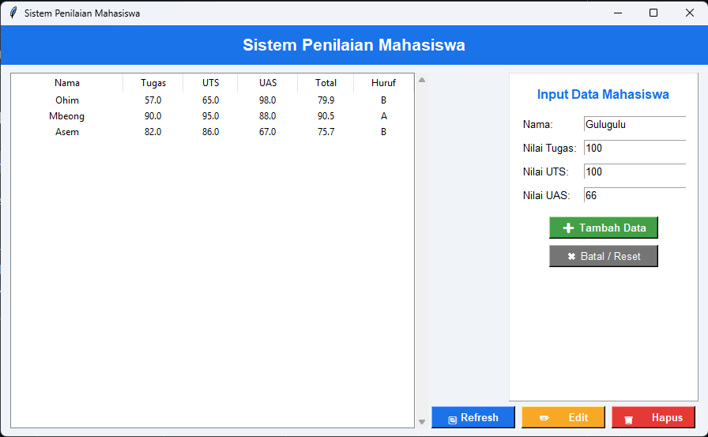
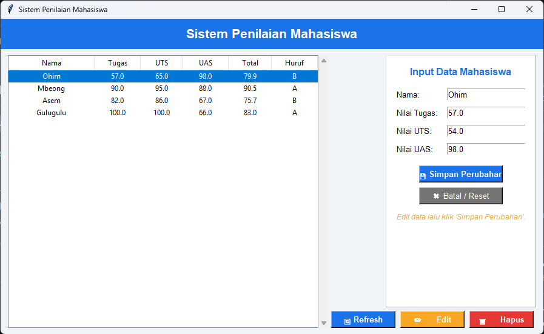
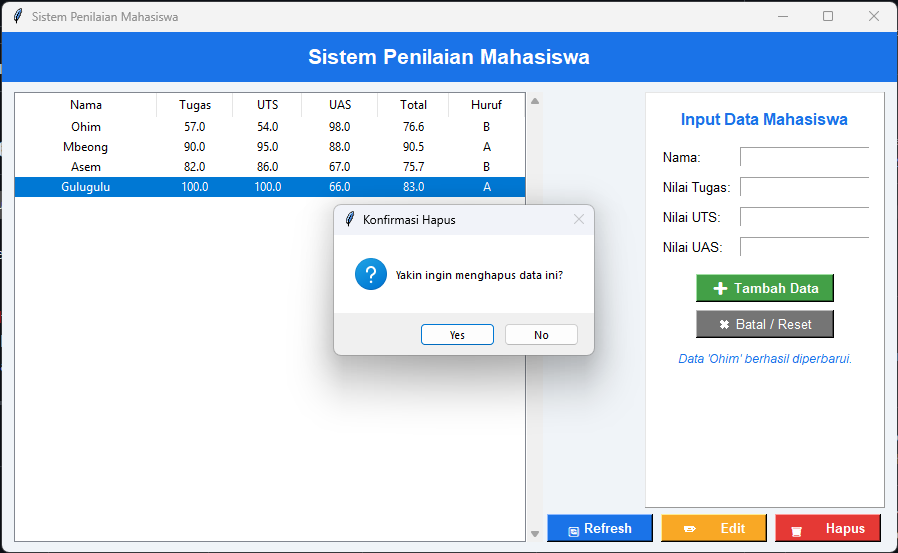

# 🎓 Gradebook (Desktop Py)

   

Gradebook is a clean, interactive desktop application built to help educators easily manage, calculate, and store student grades. 

This project is built purely with **Python** using the standard library. It utilizes **Tkinter** for the Graphical User Interface (GUI) and a **CSV file** for local data persistence, ensuring all student records are safely saved on your local machine without requiring a database setup.

---

## 📸 Preview

<div align="center">

| Main Dashboard | Add / Edit Form | Delete Confirmation |
|:---:|:---:|:---:|
|  |  |  |

</div>

---

## ✨ Key Features

* **Full CRUD Operations:** Add, Read (Refresh), Update (Edit), and Delete student records seamlessly.
* **Automatic Grade Calculation:** Automatically calculates the final score based on a weighted formula and converts it to a Letter Grade.
* **Non-Blocking UI:** Utilizes Python's `threading` module to ensure the interface remains smooth and responsive during file read/write operations.
* **Local Data Persistence:** All data is saved locally to a `student_database.csv` file. The app automatically initializes this file if it doesn't exist.
* **Form Validation:** Includes robust input validation to prevent empty fields and ensure all entered grades are valid numbers between 0 and 100.
* **Interactive Data Table:** Features a clickable Tkinter `Treeview` table to easily select specific records for editing or deletion.

---

## 🧮 Grading Logic

The application automatically processes raw scores using the following standard:

**Weighting:**
* **Tugas (Assignments):** 20%
* **UTS (Midterm):** 30%
* **UAS (Final Exam):** 50%

**Letter Grade Conversion:**
* `> 80` = **A**
* `> 66` = **B**
* `> 56` = **C**
* `> 45` = **D**
* `<= 45` = **E**

---

## 🛠️ Technology Stack

* **Language:** Python 3.x
* **GUI Framework:** Tkinter (Python Standard Library) & `ttk` for styled widgets.
* **Data Storage:** `csv` module (Python Standard Library).
* **Concurrency:** `threading` module for background I/O tasks.
* **Architecture:** Modular design separating UI (`ui_manager.py`), logic (`logic.py`), and data repository (`repository.py`).

---

## 🚀 Installation & Usage

Since this application utilizes only Python's standard libraries, you do not need to install any external dependencies via `pip`.

1. **Clone the repository:**
   ```bash
   git clone https://github.com/amaradism/gradebook-desktop-py.git
   ```
2. **Navigate to the project folder:**
   ```bash
   cd gradebook-desktop-py
   ```
3. **Run the app:**
   Execute the main entry point of the application:
   ```bash
   python main.py
   ```
   *(The `student_database.csv` file will be generated automatically in the same folder upon the first run).*

---

## 📁 Folder Structure

```text
gradebook-desktop-py/
├── assets/
│   └── screenshots/
├── logic.py
├── repository.py
├── ui_manager.py
├── main.py
├── student_database.csv      # Auto-generated database file
└── README.md
```

---

## 💡 Educational Scope

This project was developed to practice and demonstrate fundamental software engineering concepts in Python, specifically:
* **Separation of Concerns (SoC):** Structuring code into logical modules (UI, Logic, Repository) rather than keeping everything in one massive file.
* **Desktop GUI Development:** Building event-driven applications using Tkinter.
* **Concurrency:** Preventing UI freezing by handling file operations in separate threads.
* **File Handling:** Implementing robust CSV read/write operations for data persistence.
